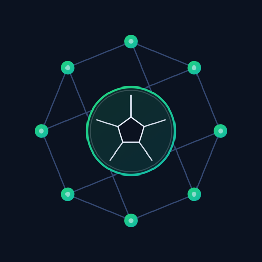

<p align="center">
  
</p>

# 🏟️ FanCircle

A peer to peer World Cup watch party. No server, no account. Fans chat, react, and predict scores over a raw Hyperswarm connection, in their own language, and tip each other USDT straight from their own wallet.

Group watch alongs today run on infrastructure that works against the fans who need it most: centralized chat that's blocked in half the countries that care about football, no real time translation for cross-border banter, and no clean way to send a friend, or a great match commentator on the other side of the planet, a few dollars. FanCircle is built to fix that during the one window it actually matters: the 2026 World Cup, final on July 19.

Built for the Tether Developers Cup, entering all three tracks:

| Track | What it does here |
|-------|----------------------------|
| **Pears** (Hyperswarm) | Match rooms (chat, reactions, prediction polls) travel peer to peer over the Hyperswarm DHT. No application server. Room history and poll tallies are backed by an Autobase replicated log, so a fan who joins mid match gets full history and a correct tally, not just whatever gossip happened to arrive after they connected. |
| **QVAC** (on-device AI) | Every message is translated on the recipient's own device through the QVAC SDK (Bergamot NMT): Vietnamese, English, Spanish, Arabic, and more. Voice notes are transcribed on-device (Whisper) and translated the same way. A small grounded LLM answers football questions (`/ask`) in whatever language you ask it. No cloud API in the loop, anywhere. |
| **WDK** | Self custodial USDT tipping to a room's host or best commentator. Each fan holds their own seed; a tip is a real on-chain transfer (Sepolia, or a local chain for zero-faucet testing). |

P2P for rooms nobody can shut down, on-device AI so a fan on a bad connection can still follow along, self-custodial money so a tip goes fan-to-fan with nothing sitting in the middle. Take any one of the three away and the pitch stops making sense, which is the point of entering all three tracks.

---

## Quick start

**Prerequisites:** [Node.js](https://nodejs.org) ≥ 22.17 (`node -v` to check), macOS / Linux / Windows. [ffmpeg](https://ffmpeg.org) is optional, only needed for voice notes; everything else runs without it.

```bash
git clone https://github.com/CareSwarm/FanCircle.git
cd FanCircle
npm install
```

Start that install before you sit down to look at this. QVAC ships prebuilt native inference binaries for every platform it supports (macOS/Linux/Windows × arm64/x64, plus mobile) in one SDK, so `node_modules` lands around 5.5 GB even though FanCircle only touches three of the roughly dozen model families in there. Expect 10–30 minutes on typical Wi-Fi, not seconds. It's a one-time cost; everything after this is fast.

Two terminals, two fans, one machine:

```bash
# Terminal 1: a Vietnamese fan
npm run demo:minh      # → http://localhost:8080

# Terminal 2: an English fan
npm run demo:alex      # → http://localhost:8081
```

Open both in the browser:

1. On 8080 (Minh), click **＋ Create room**, copy the link. The bar up top shows a real World Cup 2026 knockout fixture with both flags, not a placeholder.
2. On 8081 (Alex), paste it and **Join**. Both show 2 fans in room within a few seconds, each tagged with a flag for their language.
3. Type a message on either side, in your own language. The other fan sees it translated live, on-device.
4. **＋ New poll** runs a prediction poll; both vote, tallies sync peer to peer.
5. `/ask offside rule?` (or any football question). A small on-device LLM answers, and the room sees the answer in their own language.
6. **🎙️** records a short voice note. It's transcribed on-device, sent to the room, and each fan sees a translated transcript with the original audio playable. Needs [ffmpeg](https://ffmpeg.org): `brew install ffmpeg` / `apt install ffmpeg`. The backend logs on boot whether it found it.
7. **💸 tip** next to a fan sends USDT. This needs the one-time setup under "Enabling USDT tipping" below (a funded Sepolia wallet, or the zero-faucet local-chain mode); skip that and the button's there but there's nothing to send yet.
8. The best proof in the repo: open a third terminal, `npm run demo:sam` (→ localhost:8082), paste the same room link, and join. Sam wasn't around for any of the above (no server ever stored it), but the room's Autobase log replicates to him, and a green **⏪ Synced N updates** banner lands with the full chat history and the correct poll tally, translated straight into Spanish. This is the hardest engineering in the repo (`src/roomlog.mjs`, proven end to end in `spikes/spike-lateJoiner.mjs`), and easy to miss if you stop at step 7.

First use of each AI feature downloads a model, once, then it's cached and offline: translation is ~20–35 MB per language pair, the match assistant is ~380 MB (Qwen3-0.6B, shows a progress toast), voice notes are ~80 MB (Whisper base, same). All three come through QVAC's own registry rather than a generic download bar, so expect a pause the first time on a cold machine. After that, turn off your Wi-Fi and keep chatting: translation, `/ask`, and voice notes all keep working. That's what "on-device" is supposed to mean.

Two machines on different networks work the same way. Share the room link over any channel and the Hyperswarm DHT connects them directly.

---

## How each track is used

### Pears: `src/p2p.mjs` (gossip) + `src/roomlog.mjs` (durable history)

A room is a 32-byte topic. Peers `swarm.join(topic)` and connect directly over the Hyperswarm DHT with Noise-encrypted streams, the pattern from the official "Making a Pear Desktop Application" guide. Chat, reactions, poll creation, and votes are newline-delimited JSON gossiped to every connected peer for instant delivery. The localhost WebSocket in this build is UI-to-process IPC, nothing more (think Electron IPC); every fan-to-fan message moves over Hyperswarm.

On top of that, the room creator runs an Autobase, a Holepunch multiwriter append-log, and every peer replicates it over its own Hyperswarm swarm (Corestore replication is a separate protocol from the raw gossip and needs its own connections). Chat, votes, voice notes, assistant answers, and tips are durably appended; when a fan joins mid-match, their backend replays that log: full chat history and an authoritative poll tally, translated on-device into their language, not just whatever gossip happened to arrive after they connected. Reactions stay gossip-only on purpose: nobody wants fifty old 🔥 replaying on join. Multi-writer rooms (any peer appending directly, granted via Autobase's `addWriter`) work (see `spikes/spike-autobase.mjs`) and are the natural next step up from this single-writer-per-room build.

Check it yourself: `npm run spike:p2p` spins up two swarms that find each other over the live DHT and trade messages. `node spikes/spike-autobase.mjs` shows multi-writer convergence and late-join replication in isolation. `node spikes/spike-lateJoiner.mjs`, run against three live backends, proves it through the real app: a third fan joining after messages and votes already happened gets full backfill and a correct tally.

### QVAC: `src/ai.mjs` (translation) + `src/assistant.mjs` (match assistant)

Translation runs on-device through the QVAC SDK (`@qvac/sdk`), using Bergamot NMT models pulled from QVAC's registry. Each fan sets their language; anything arriving in a different one gets translated locally before it renders. Pairs with no direct model pivot through English automatically.

The match assistant (`/ask …`) is a small grounded LLM, Qwen3-0.6B, run through QVAC's `completion()`, answering rules and stats questions on-device. A question gets translated to English, answered locally, and the answer goes back to the room translated into each fan's own language.

Voice notes (`src/voice.mjs`): the browser records with `MediaRecorder`; the sender's backend decodes the clip with ffmpeg (a local container conversion, not an AI call) and transcribes it on-device with QVAC's multilingual Whisper (`WHISPER_BASE_Q8_0`). The transcript broadcasts over the room; each peer translates it on their own device before display, and the original audio comes along too so peers can hear the real voice. No cloud AI call anywhere in that chain, which is the whole requirement of this track and the reason it survives with the network off.

Check it yourself: `npm run spike:qvac` translates English↔Vietnamese on-device (~250 ms/sentence once cached). `node spikes/spike-llm.mjs` runs the grounded assistant standalone. `node spikes/spike-voice.mjs <audio-file> [lang]` runs on-device transcription on any clip you give it.

### WDK: `src/wallet.mjs`

Each fan gets a self-custodial BIP-39 wallet via `@tetherto/wdk` and `@tetherto/wdk-wallet-evm` (no custodian, the seed never leaves the machine). A tip calls the account's `quoteTransfer()` for a fee estimate, then `transfer()` for a real ERC-20 USDT transfer, on Sepolia or a local chain for zero-faucet testing (see "Enabling USDT tipping" below). The chat bubble always shows the tx hash: a clickable Etherscan link when one exists, a click-to-copy hash when it doesn't (a local chain has no public explorer to link to).

Check it yourself: `npm run spike:wdk` creates a wallet, derives HD accounts, and reads a live Sepolia balance.

---

## Enabling USDT tipping

Chat and translation need no blockchain at all. To demo tipping, pick one:

**Option A: local chain, zero faucet, fastest for judges.** Needs [Foundry](https://getfoundry.sh) (`anvil`, `forge`).

```bash
anvil                                       # terminal A: local EVM
npm run chain:setup                         # terminal B: deploy mock USDT, fund both wallets
FANCIRCLE_CHAIN=local npm run demo:minh     # terminal C
FANCIRCLE_CHAIN=local npm run demo:alex     # terminal D
```

Both wallets start with 1000 USDT; the tip button sends a real transfer on the local chain. The chat bubble shows the tx hash — click it to copy, then verify it yourself: `cast tx <hash> --rpc-url http://127.0.0.1:8545` (or just check the sender's balance drop). No faucet, no account, nothing to sign up for.

**Option B: Sepolia public testnet, real and Etherscan-verifiable.** Print your two demo wallet addresses:

```bash
node scripts/wallet-info.mjs
```

For each address: grab test ETH from a Sepolia faucet ([sepolia-faucet.pk910.de](https://sepolia-faucet.pk910.de) or [Google Cloud's](https://cloud.google.com/application/web3/faucet/ethereum/sepolia)), grab mock USDT from the [Candide](https://dashboard.candide.dev/faucet) test-ERC20 faucet, then:

```bash
FANCIRCLE_USDT=0xd077A400968890Eacc75cdc901F0356c943e4fDb npm run demo:minh
FANCIRCLE_USDT=0xd077A400968890Eacc75cdc901F0356c943e4fDb npm run demo:alex
```

`0xd077A400968890Eacc75cdc901F0356c943e4fDb` is Candide's "Tether USD" test token on Sepolia (verified: `name()`/`symbol()`/`decimals()` resolve, and a real 20 USD₮ transfer confirmed on-chain — [tx](https://sepolia.etherscan.io/tx/0xcf2c209f766ad84107086245d64502c9f05a1bb9e7132462591b0a22c3906976)). The faucet page itself shows a *different* address — that's its own distributor/limiter contract, not the token; calling `balanceOf`/`decimals` on it reverts. If a faucet ever rotates its token, re-derive the real address from its contract's "Token Holdings" tab on Etherscan rather than the address the faucet page displays.

Now the wallet shows a real USDT balance and the tip button sends a real on-chain transfer. Gasless "pay fees in USDT" via WDK's ERC-4337/7702 modules is on the roadmap below, not shipped yet.

---

## Architecture

```
Browser UI (app/)  ──WebSocket──►  Node backend (src/backend.mjs)  ──►  Room  (Pears / Hyperswarm)  ──DHT──►  other fans
   one per fan                     one process = one fan            ├──►  AI    (QVAC / on-device translate)
                                                                    └──►  Wallet (WDK / USDT on Sepolia)
```

`src/p2p.mjs` is deliberately self-contained so the P2P layer can move into a Bare worklet for native Pear-app packaging (`pear://` distribution, P2P OTA updates); see the roadmap.

---

## Third-party services (disclosure)

- **QVAC model registry**: translation (Bergamot), voice transcription (Whisper), and the match assistant (Qwen3) all fetch their model on first use, then run from a local cache. Inference is 100% on-device.
- **Ethereum RPC**: `https://sepolia.drpc.org`, a public Sepolia RPC, for balance reads and broadcasting tip transactions. Blockchain infrastructure, not an AI service.
- **Testnet faucets**: [Candide's test-ERC20 faucet](https://dashboard.candide.dev/faucet) for mock USDT, a public Sepolia faucet for ETH, used only to fund demo wallets.

No pre-existing project code went into this; it was built during the hackathon window. Open-source dependencies are listed in `package.json`.

---

## Roadmap

- **Multi-writer rooms**: any fan, not just the creator, durably appends via Autobase's `addWriter`. Already proven in `spikes/spike-autobase.mjs`.
- **Assistant RAG**: QVAC's full RAG pipeline over live match data, plus a stronger LLM fallback for translating idiom and slang.
- **Gasless USDT tipping**: WDK's ERC-4337/EIP-7702 modules, so fans pay fees in USDT and never need ETH.
- **Native Pear app**: the P2P core in a Bare worklet plus an Electron shell, distributed over `pear://` with peer-to-peer updates.

## Running multiple fans on one machine (for testing)

Each backend is one fan: `npm run demo:minh`, `demo:alex`, or `PORT=... NAME=... LANG_CODE=... WALLET_DIR=... node src/backend.mjs` for more. This works fine for local testing with one caveat: QVAC's model cache (`~/.qvac`) is shared machine-wide, and each backend spawns its own `bare` inference worker, so running several at once can occasionally hit a transient "file descriptor could not be locked" the first time two backends hit the registry at the same instant. `src/ai.mjs` and `src/assistant.mjs` retry automatically and it self-heals within a couple seconds. This never comes up in real use; every fan is on their own device with their own cache.

---

## License

[Apache-2.0](LICENSE). Public for the duration of the Tether Developers Cup and a reasonable period after.
